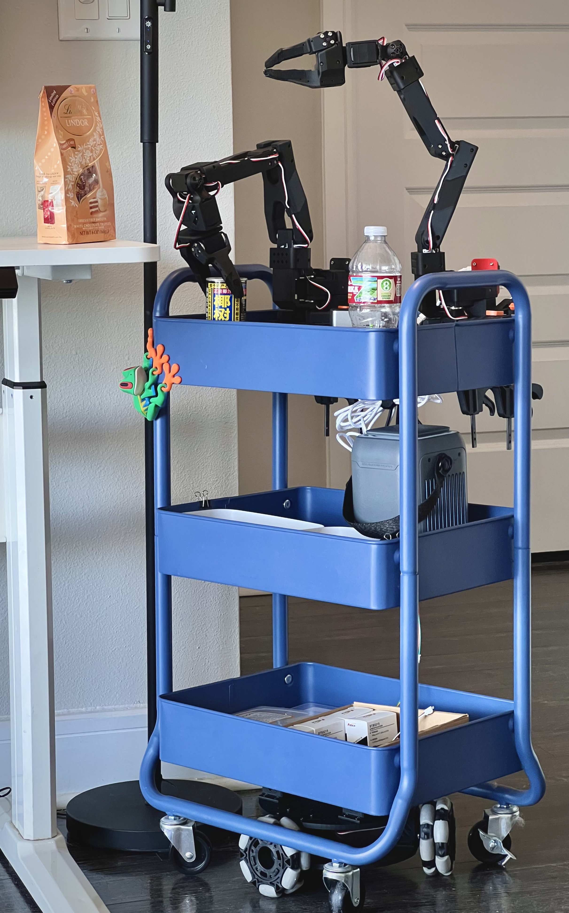
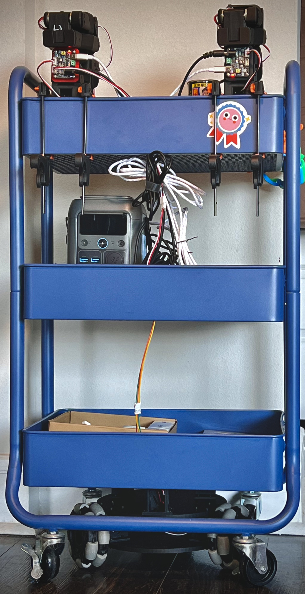
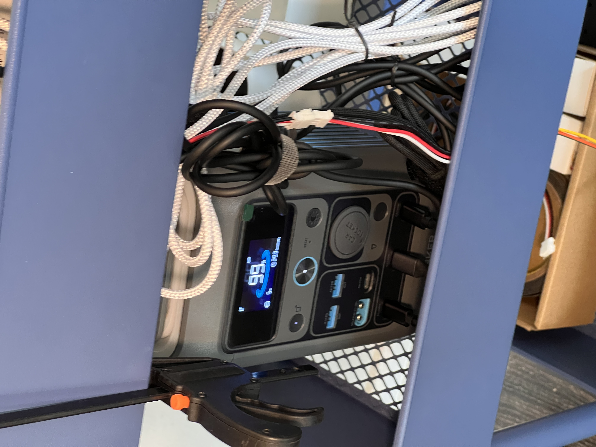

> [!NOTE] 
> Currently actively working. There could be incorrect information. Planning on finish the first version **XLeRbot 0.1.0** in a week, will delete this note when the first version is finished. Please be patient....

# XLeRobot 🤖

---

**🚀 Bringing Embodied AI to Everyone - Cheaper Than an iPhone! 📱**  
*Built upon the giants: [LeRobot](https://github.com/huggingface/lerobot), [SO-100](https://github.com/TheRobotStudio/SO-ARM100), [Lekiwi](https://github.com/SIGRobotics-UIUC/LeKiwi), [Bambot](https://github.com/timqian/bambot)*

---

## 🌟 Why XLeRobot?  
We answer this separately since    **XLeRobot = XL + LeRobot**
<table>
  <tr>
    <td width="50%">
      
### Why "LeRobot" Core?
- **Cheap Materials** 💴: 90% 3D printed, with cheap motors and electronics.
- **Easy Assembly** 🔨: Screw for 2hrs and here it is.
- **Plug-&-Play** 🧩: Make robots perform by simple pip install and running a few lines.
- **Thriving Community** 🌍:
  World's largest low-cost robotics community with
  - Multiple SOTA pretrained AI models🧠, datasets📊, and tools🔨 for direct deploy. 
  - Thousands of brilliant minds for brainstrom and discussions🧑‍🤝‍🧑.     
    </td>
    <td width="50%">
    
### Why "XL" Enhancement? 
- 🏠 Currently, there is a lack of affordable, stable, general-purpose home mobile robots with dual arms that are as easy to build as LeRobot.
- 🖨️ 3D printed frames have limited durability, stability, and load capacity, while being complex to assemble and impractical for daily use.
- ⚡ Power supply remains a challenge for DIY mobile robots, resulting in complicated wiring configurations.
- 🤖 XLerobot uses the same setup configuration as most dual-arm tabletop manipulation systems in the LeRobot community, enabling straightforward code and policy transfer.   
    </td>
  </tr>
</table>

<table>
  <tr>
    <td width="35%">
      
    </td>
    <td width="65%">
      
### Overall advantages/goals of XLeRobot

- **Cost-effective** 💴: complete make under $700 , with upgrades from existing SO100Arm and Lekiwi for less than $250 .
- **Easy upgrade** ⏫ (physical and electrical) for **Lekiwi** and **SO100**
    - No motor id changes or hardware modifications needed
- **Practical and reliable** 💪: capable of completing many daily tasks performed by $20,000 dual-arm mobile robots on the market.
    - Such as: open doors🚪, serve drinks☕, clean tables🧹, moving clothes to baskets👕, grab from the fridge🍱, etc.
    - More tasks demonstrated in the Lerobot hackathon in [Shanghai](https://www.youtube.com/watch?v=1oXvINlYsls&ab_channel=SeeedStudio) and [Mountain View](https://x.com/asierarranz/status/1905306686648132061).
    - **Note**: Currently not designed for tasks requiring in-hand dexterity 🤹, heavy lifting (over 1kg per arm) 🏋️, or highly dynamic movements 🏃
- **Rich open-source resources** 📕
    - Lerobot's plug-and-play code🧩 and numerous AI models🧠
    - Supported by an active, growing community of contributors🧑‍🤝‍🧑

    </td>
  </tr>
</table>

---
## 🎯 Demo Video 0.0.5
> [!NOTE]
> Currently just a single arm version by directly implementing Lekiwi, teleoped by the other follower arm. 3x speed.

https://github.com/user-attachments/assets/2e9eb3c9-af16-4af2-8748-8f936278c8eb

---
---
## 🚀 Get Started（Detailed Tutorial）TODO
1. **Buy your parts**: Bill of Materials
2. **Print your stuff**: 3D printing instructions
3. Avengers: **Assemble**!
4. **Software**: Get your robot moving!
---
---

## 🛠️ Hardware Intro

XLeRobot = Lekiwi + 1x SO100 arm + **IKEA RÅSKOG Cart** + **Anker Battery**

= 2x SO100 Arms + 3x omni wheels + RasberryPi + **IKEA RÅSKOG Cart** + **Anker Battery**

> [!NOTE]
> *All compute handled by your PC - Raspberry Pi only manages data/wifi 📶*

<table>
  <tr>
    <td width="50%">
      
### Why IKEA RÅSKOG Cart?
- 🌎 Global availability with standardized design
- 💰 Cost-effective
- 🏗️ Simple structure yet sturdy construction
- 🔧 Mesh design enables easy mounting of components
- 📦 Perfect for storage and transportation of items
- 📏 Ideal height for common household surfaces—from stovetop to coffee table

    </td>
    <td width="50%">
    
### Why Anker SOLIX C300 Power Station? 
- 🌍 Global availability
- ⚡ 288Wh capacity, 300W maximum output power, 280W maximum charging power
- 🔌 Powers both 12V arms, base, and Raspberry Pi at full capacity through three Type-C charging cables—eliminating complex wiring system
- 🔋 Exceptional battery life: 10 hours with normal use, 6 hours under intensive operation, and only 1 hour to fully charge
- 💡 Integrated lighting for nighttime operation
- ☀️ Optional solar panel mounting for continuous power supply
- 🎒 Versatile and detachable—serves beyond robotics in daily life as emergency backup power or camping power source

    </td>
  </tr>
</table>

*All compute handled by your PC - Raspberry Pi 5 only manages data/wifi 📶*

---

## 🧠 Software Intro
Here's a general idea of how you can control the robot and make it smart:

### Basic Control

Joint control → leader-follower arm control

End Effector control → VR remote control

### Paths towards General Embodied Machine Intelligence

**Two main approaches exist for making robots intelligent, reflecting the primary methods in current academic robotics manipulation research** (This is a simplified comparison, as many works combine benefits from both approaches)
<table>
  <tr>
    <td width="50%">
      
### **End-to-End Visual-Motor Policy (VLA)**  
- 🎮 **No calibration needed** - perfect for beginners  
- 👁️ Uses RGB cameras + LeRobot's pretrained models  
    </td>
    <td width="50%">
    
### **Hierarchical Sim2Real**  
- 🌐 **Maniskill Simulation** (GPU-accelerated)  
- 📐 Physics-based planning for precision  
    </td>
  </tr>
</table>

> [!NOTE]
> For the first version we mainly focus on the hardware. The LeRobot code hasn't been modified yet. You can run the original Lekiwi demo by connecting one arm to the Raspberry Pi and another arm to the desktop to recreate the Demo 0.0.5 by remote control. The Lerobot code for XLeRobot will be soon updated with highest priority.

---

## 🎯 Who is XLerobot For?

- 🚀 **Startups & Labs**: Build prototypes faster with the world's cheapest modular platform
- 👩🔬 **Self Researchers**: Experiment with embodied AI without breaking the bank 💸
- 🎓 **Education Heroes**:
  - High School Teachers: Bring cutting-edge robotics to STEM classes 🧪
  - University Professors: Affordable platform for robotics/AI courses 📚
  - Students: From beginners to researchers 🎒→🎓
- 🤖 **DIY Enthusiasts**: Perfect for indoor projects - plant care, delivery bots, home automation 🌱📦

---

## 🛠️ Total Cost
> [!NOTE] 
> We want XLeRobot to be powerful, so there's only a 12V version.
> Doesn't include cost of 3D printing

| Price| US  | EU  | CN |
|---------|----:|----:|----:|
| **Build from Scratch** |  **$482**  |  **€545.8**  |  **¥2891**  |
| **Build from 2 SO100 arms**  |  **$499**  |  **€526**  |  **¥2829**  |
| **Build from 1 Lekiwi** |  **$248**  |  **€295**  |  **¥1571**  |

For details please see [Bill of Materials](BOM.md).

Not affiliated with IKEA (but we love swedish meatball! 🍝)

---

## Limitations

(Hey, for this price point, what more could you ask for?)

- 🔒 Fixed height—adding a stable lifting platform would significantly increase costs and assembly difficulty
- 📏 Smaller workspace compared to Aloha—objects must be placed within reach, though it still handles the majority of its tasks
- ⚖️ Limited payload capacity for a single arm: that's why the cart is here
- 🛒 Base movement precision may be affected by the wheels of IKEA cart (can be addressed through closed-loop feedback control)

All things considered—cost, community support, ease of assembly, and practical utility—XLeRobot stands out as the most compelling low-cost robot for indoor applications

---

