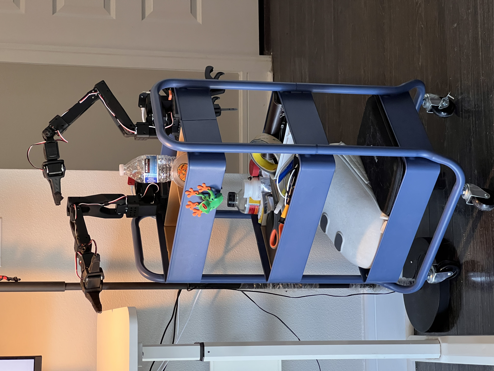

This is the open-source repo for XLeRobot, including hardware desgins, bill of materials, modified LeRobot codes, etc. Currently actively working, planning on finish the first version XLeRbot 0.1.0 in a week, please be patient....


[](https://opensource.org/licenses/Apache-2.0)
[](https://twitter.com/VectorWang2)
[](https://discord.gg/s3KuuzsPFb)
---
# XLeRobot 🤖

**🚀 Bringing Embodied AI to Everyone - Cheaper Than an iPhone! 📱**  
*Built upon the giants: [LeRobot](https://github.com/huggingface/lerobot), [SO-100](https://github.com/TheRobotStudio/SO-ARM100), [Lekiwi](https://github.com/SIGRobotics-UIUC/LeKiwi), [Bambot](https://github.com/timqian/bambot)*

---
<table>
  <tr>
    <td width="40%">
      
    </td>
    <td width="60%">

## 🌟 Why XLeRobot?  
XLeRobot = XL + LeRobot

### Why "LeRobot" Core?
- **Cheap** 💴: 90% 3D printed, with cheap parts.
- **Easy** 🔨: Just screw and connect for 2hrs and here it is.
- **Plug-&-Play** 🧩: see robots work with running a few lines.
- **Thriving Community** 🌍: World's largest low-cost robotics community with
  - Multiple SOTA pretrained AI models🧠, datasets📊, and tools🔨. 
  - Thousands of brilliant minds for brainstrom and discussions🧑‍🤝‍🧑.

### Why "XL" Enhancement? 
- 🏠 Currently, there is a lack of affordable, stable, general-purpose home robots with dual arms that are as easy to build as LeRobot
- 🖨️ 3D printed frames using consumer printers and PLA have limited durability, stability, and load capacity, while being complex to assemble and impractical for daily use
- ⚡ Power supply remains a challenge for mobile robots, resulting in complicated wiring configurations
- 🤖 XLerobot uses the same setup configuration as most dual-arm tabletop manipulation systems in the LeRobot community, enabling straightforward code and policy transfer

    </td>
  </tr>
</table>

## 🌟 Why XLeRobot?  
### **Why "LeRobot"?**  
🖨️ **Simplest Hardware Assembly**:  
- Fully 3D-printable (consumer-grade printers + PLA) except electronics  
- Largest open-source community for low-cost robotics 🤝  
- Pre-trained AI models & datasets ready to deploy 🧠  
- Direct code testing on dual-arm manipulators  

### **Why "XL" Over Lekiwi/Bambot?**  
🔧 **Practicality Meets Affordability**:  
- Solves common DIY pitfalls:  
  - ❌ 3D-printed frames: Weak, unstable, complex assembly  
  - ❌ Power management chaos  
- **80% of ALOHA's daily tasks** at 1/10th the cost:  
  - Open doors 🚪 | Serve drinks ☕ | Tidy clothes 👕 | Fetch fridge snacks 🥤  
- **Plug-and-Play Upgrade**:  
  - Add mobility to SO-100/Lekiwi arms for **<$250**  
- **Global IKEA Compatibility** 🌍 + **24hr Solar-Powered** ☀️  

---

## 🛠️ Hardware: IKEA Hacks Meet Modern Tech  
**XLeRobot = Lekiwi + 2×SO100 Arms + IKEA RÅSKOG Cart + Anker SOLIX C300**  

| Component           | Superpowers 🔋                          |
|---------------------|----------------------------------------|
| **IKEA RÅSKOG Cart** | 🛒 Universal mobile base <br> 🌐 Global availability <br> 🧱 Modular mesh platform |
| **Anker SOLIX C300** | ⚡ 24hr runtime <br> 🔌 Single cable for arms/base/RPi <br> 🏕️ Dual-use for camping/emergencies |
| **SO-100 Arms**     | 🤖 Direct code transfer from LeRobot <br> 🔧 No hardware modifications needed |

*All compute handled by your PC - Raspberry Pi 5 only manages data/wifi 📶*

---

## 🧠 Software: Two Paths to Robot IQ  
### **Option 1: End-to-End Visual-Motor Policy (VLA)**  
- 🎮 **No calibration needed** - perfect for beginners  
- 👁️ Uses RGB cameras + LeRobot's pretrained models  

### **Option 2: Hierarchical Sim2Real**  
- 🌐 **Maniskill Simulation** (GPU-accelerated)  
- 📐 Physics-based planning for precision  

```bash
# Current Demo Setup (Works out-of-box!)
python lekiwi_remote.py \ 
    --arm1 raspberry_pi_ip \ 
    --arm2 desktop_ip
```
Full XLeRobot control code coming soon! 🚧


---

## 🎯 Who is XLerobot For?

- 🚀 **Startups & Labs**: Build prototypes faster with the world's cheapest modular platform
- 👩🔬 **Self Researchers**: Experiment with embodied AI without breaking the bank 💸
- 🎓 **Education Heroes**:
  - High School Teachers: Bring cutting-edge robotics to STEM classes 🧪
  - University Professors: Affordable platform for robotics/AI courses 📚
  - Students: From beginners to researchers 🎒→🎓
- 🤖 **DIY Enthusiasts**: Perfect for indoor projects - plant care, delivery bots, home automation 🌱📦

---

## 🛠️ Total Cost
> [!NOTE] 
> We want XLeRobot to be powerful, so there's only a 12V version.
> Doesn't include cost of 3D printing

| Price| US  | EU  | CN |
|---------|----:|----:|----:|
| **Build from Scratch** |  **$482**  |  **€545.8**  |  **¥2891**  |
| **Build from 2 SO100 arms**  |  **$499**  |  **€526**  |  **¥2829**  |
| **Build from 1 Lekiwi** |  **$248**  |  **€295**  |  **¥1571**  |

For details please see [Bill of Materials](BOM.md).

Not affiliated with IKEA (but we love swedish meatball! 🍝)

---

## 🎯 Hardware
Please see hardware assembly details at
- Why use IKEA and Anker ?
- They are both selling world wide.
- IKEA RASKOG cart is famous around the world as the 
- Though anker may seem a little expensive, the technology is worth it. At least 10 hours of continuous action


---

## 🎯 Demo Video 0.0.5

This is currently just a single arm version of directly implementing Lekiwi, teleoped with another arm 
(FYI: The follow arm hardware can be also used as the leader arm, the only difference is that it's geared so there will be some resistance)

https://github.com/user-attachments/assets/2e9eb3c9-af16-4af2-8748-8f936278c8eb


